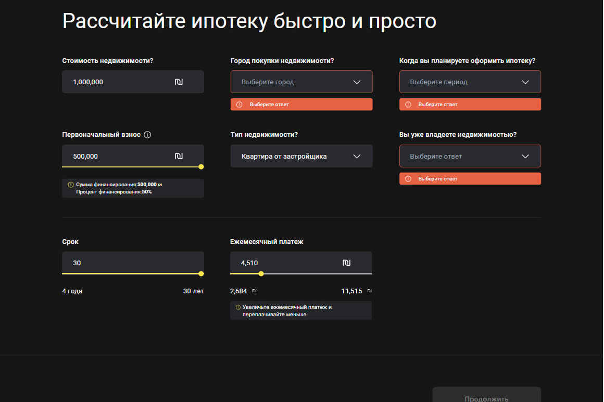

# React + TypeScript + Vite

# Создание калькулятора ипотеки 

Создание калькулятора ипотеки наподобие [Сбербанка](https://domclick.ru/ipoteka/calculator?utm_referrer=https%3A%2F%2Fwww.google.com%2F)

[Демо](https://margaretrixten.github.io/bankimonline/) моего калькулятора

При правильном заполнении всех полей, система отображает в поле ежемесячный платеж по ипотеке.

По дефолту показывается минимальное значение.

Поле платежа взаимосвязано со значением поля "Срок ипотеки". По мере изменения срока изменяется ежемесячный платеж. Тем меньше срок, тем больше ежемесячный платеж и наоборот.

Шкала range и значение платежа инпута взаимосвязаны. При перемещении скролла меняется и значение инпута и, наоборот, при изменении значения - скролл перемещается.

По умолчанию кнопка "Продложить" disabled.

Если пользователь не заполнил какой-то input и нажал на неактивную кнопку
"Продолжить" то платформа должна показывать ему незаполенные поля и выдавать ошибку что то или иное поле не заполнены.

Если пользователь заполнил все поля, то кнопка "Продолжить" должна подсветиться желтым цветом.

Сделать простое сохранение полей формы в localstorage после нажатия кнопки "Продолжить", так же имитировать отправку формы на условный роут, используя менеджер глобального состояния Redux Toolkit